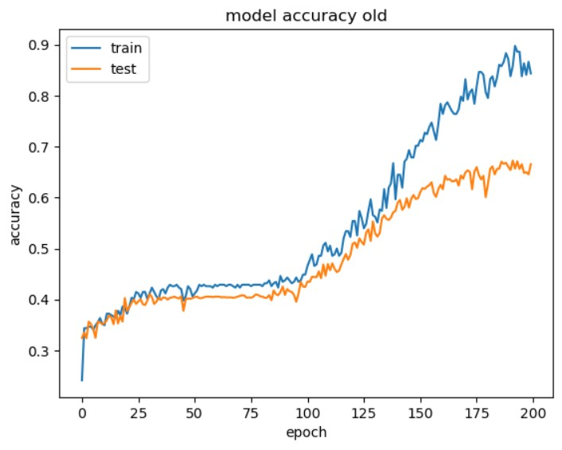
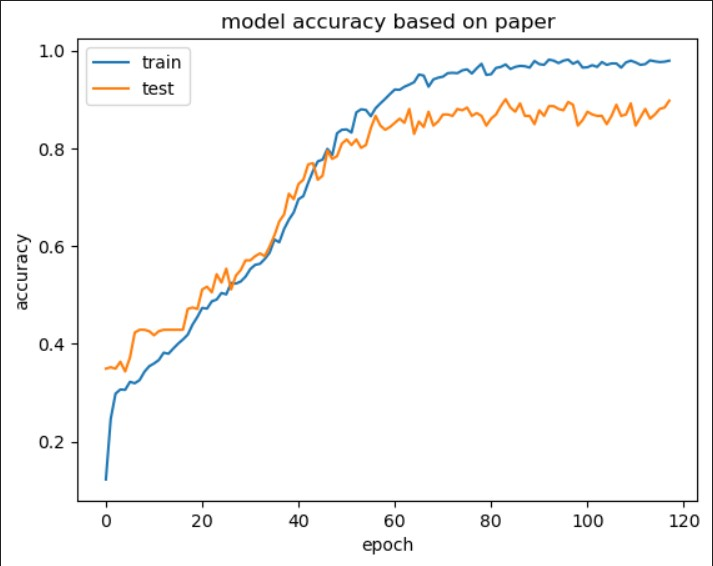

This is a more complex project where i work on implementing a face recognition web app on my website.
The user can upload a picture and his/her name to be recognized by the web app via the camera.

Done:
- simple website is set up in html/css/js and hosted: https://database-dc7f0.web.app/
- input at https://database-dc7f0.web.app/project.html is streamed to storage and realtime database firebase using JavaScript
- files from the real-time database are retrieved with the Python library requests and stored in easily accessible pandas dataframe
- opencv is used to process the images
- git ignore file added to not store data in public github repo
- url to database is not longer visible in data_download.py
- it is still visible in the website path but since this repo is only for private usage and showcasing not important for now (website ordner wouldn't be visible in release version
- prototype model to predict
- camera connection to browser using flask
- model is now fully functional
- input image augmentation is used to somehow compensate lack of data
- build-in camera: user can use camera to take a picture on the website itself
- file upload restricted to .jpg and .png
- data from https://scikit-learn.org/0.19/datasets/labeled_faces.html
- the model has been greatly improved by model construction inspired by this research paper: https://www.sciencedirect.com/science/article/pii/S2667305323000376

Planned:
- use opencv to capture frames from camera input -> do live prediction
- button to train cnn on upload data
- implementation of recognition system in browser using flask
- use cloud services to not have to run server locally
